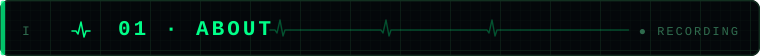
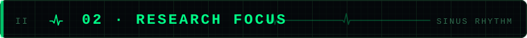
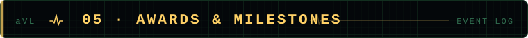
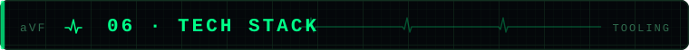
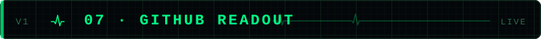
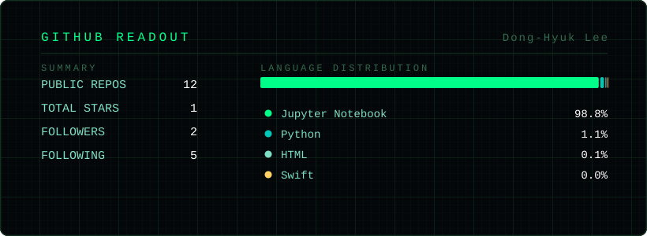

<div align="center">

<!-- Animated ECG monitor header -->


<br><br>

[LinkedIn](https://www.linkedin.com/in/dong-hyuk-lee-8542971b0/) ·
[Notion](https://www.notion.so/81ff1f23dd8441ba82bb77d9165426b7?source=copy_link) ·
[Instagram](https://www.instagram.com/hyuk_i2/) ·
[GitHub](https://github.com/hyuki0003) ·
[hyuki0003@gmail.com](mailto:hyuki0003@gmail.com)

<br>

**[01 About](#01--about) · [02 Research Focus](#02--research-focus) · [03 Publications](#03--publications) · [04 Experience](#04--experience) · [05 Awards & Milestones](#05--awards--milestones) · [06 Tech Stack](#06--tech-stack) · [07 GitHub Readout](#07--github-readout)**

</div>


<a id="01--about"></a>



> **"A heartbeat lasts a moment — the story it tells lasts a lifetime."**

```
┌─ ECG REPORT ───────────────────────────────────────────────┐
│  NAME       Dong-Hyuk Lee                                  │
│  ROLE       AI Researcher  ·  Medical AI Co., Ltd.         │
│  DEPT       AI Group, R&D Dept.                            │
│  FOCUS      ECG × Deep Learning                            │
│  PRIOR      Kwangwoon Univ.  ·  NeuroAI Lab.               │
│  STATUS     ● RECORDING                                    │
└─────────────────────────────────────────────────── LEAD II ┘
```

I'm an **AI Researcher** at [**Medical AI Co., Ltd.**](https://www.medicalai.com/ko/), building deep learning systems that read what the human eye cannot — from the **ECG**.

My research sits at the intersection of **representation learning** and **physiological signals**: I design contrastive and multimodal objectives that pull clinically meaningful structure out of raw biosignals.

```python
class DongHyukLee(AIResearcher):
    def __init__(self):
        self.affiliation = "Medical AI Co., Ltd. — AI Group, R&D Dept."
        self.mission     = "From waveform to diagnosis"

    def research(self, ecg: Signal) -> ClinicalInsight:
        return {
            "disease_screening": "Multi-label cardiac abnormality detection",
            "cardiac_age":       "Biological heart age estimation",
            "beyond_diagnosis":  "Hidden physiological states encoded in ECG",
        }
```


<a id="02--research-focus"></a>



### 2.1 · Current Directions

```
┌─ INTERPRETATION ───────────────────────────────────────────┐
│ Representation learning on physiological signals.          │
│ Contrastive and multimodal objectives that pull            │
│ clinically meaningful structure out of raw biosignals.     │
└────────────────────────────────────────────── SINUS RHYTHM ┘
```

<div align="center">

| | Direction | Description |
| :---: | :--- | :--- |
| `01` | **ECG-based Diagnosis** <br> <sub>Multi-label cardiac abnormality detection</sub> | 다양한 심장 질환을 딥러닝으로 스크리닝 |
| `02` | **ECG Foundation Model** <br> <sub>Construct & Optimize ECG foundation model</sub> | 심전도 기반 거대 모델 설계 및 최적화 |
| `03` | **Beyond the Waveform** <br> <sub>Hidden physiological states</sub> | 파형 너머의 생리학적 상태를 찾아내는 표현학습 |

</div>

### 2.2 · Keywords

<div align="center">

| | |
| ---: | :--- |
| **Primary** | `ECG Deep Learning` &nbsp; `Cardiac Age Estimation` &nbsp; `Biosignal Processing` |
| **Secondary** | `Multimodal Learning` &nbsp; `Contrastive Learning` &nbsp; `eXplainable AI` &nbsp; `Emotion Recognition` |

</div>

### 2.3 · Research Journey

| Signal | Method | Application | Venue |
| :--- | :--- | :--- | :--- |
| **Facial Video** | Balanced CL · Global-Local CL <br> <sub>Spatio-Temporal Maps × Cross-Attention</sub> | Remote Heart Rate Estimation <br> <sub>rPPG</sub> | `ICEIC '25` `IEIE '24·'25` <br> <sub>JBHI in progress · Patent filed</sub> |
| **Conversation** <br> <sub>Audio · Text · Vision</sub> | Inter-Dialog CL <br> <sub>Multimodal Graph Representation</sub> | Emotion Recognition <br> <sub>in Conversations</sub> | `ICASSP '26` `KOSOMBE '24` <br> <sub>Oral · Best Poster · TAFFC review</sub> |
| **Wearable Biosignals** | Multimodal physiomarker analysis | Alcohol Craving-State Detection | `IEIE '25` <br> <sub>JBHI review</sub> |
| **ECG** <br> <sub>← current</sub> | Foundation model adaptation <br> <sub>Multi-label / multi-task learning</sub> | Disease screening · Cardiac age <br> <sub>Hidden physiological states</sub> | `Medical AI` <br> <sub>industry research</sub> |


<a id="03--publications"></a>


<div align="center">

`1st author` &nbsp;·&nbsp; `ORAL` &nbsp;·&nbsp; `AWARD` &nbsp;·&nbsp; `UNDER REVIEW` &nbsp;·&nbsp; `IN PROGRESS`

</div>

### 3.1 · Journal Articles

| Status | Venue | Title |
| :---: | :--- | :--- |
| `IN PROGRESS` | **IEEE JBHI** <br> <sub>2026</sub> | Remote Heart Rate Estimation via Global-Local Contrastive Learning for Robust Physiological Measurement <br> <sub>**D.-H. Lee**, D. H. Kim, Y.-S. Choi &nbsp; `1st author`</sub> |
| `UNDER REVIEW` | **IEEE TAFFC** <br> <sub>2026</sub> | Topology-Aware Cross-Modal Alignment for Robust Multimodal Fusion in Conversational Emotion Recognition <br> <sub>D. H. Kim, **D.-H. Lee**, Y.-S. Choi</sub> |
| `UNDER REVIEW` | **IEEE JBHI** <br> <sub>2026</sub> | Identifying Wearable Multimodal Physiomarkers under Graded Alcohol Craving Level During VR Cue Elicitation <br> <sub>D. H. Kim, M. S. Lee, **D.-H. Lee**, J.-Y. Lee, Y.-S. Choi, et al.</sub> |

### 3.2 · International Conferences

| Year | Venue | Title |
| :---: | :--- | :--- |
| **2026** | **ICASSP** <br> <sub>`ORAL`</sub> | Inter-Dialog Contrastive Learning for Multimodal Emotion Recognition in Conversations <br> <sub>**D.-H. Lee**, D. H. Kim, Y.-S. Choi &nbsp; `1st author`</sub> |
| **2025** | **ICEIC** | Remote Heart Rate Estimation From Facial Videos With Balanced Contrastive Learning <br> <sub>**D.-H. Lee**, D. H. Kim, Y.-S. Choi &nbsp; `1st author`</sub> |

### 3.3 · Domestic Conferences

<details>
<summary><b>펼쳐보기 &nbsp;·&nbsp; 5 papers</b></summary>

<br>

| Date | Venue | Title |
| :---: | :--- | :--- |
| **2025.11** | IEIE Autumn | Correlation Analysis of Biomarkers using Multimodal Biosignals for Detecting Craving States in Patients with Substance Use Disorder <br> <sub>M. S. Lee, D. H. Kim, **D.-H. Lee**, J.-Y. Lee, Y.-S. Choi, et al.</sub> |
| **2025.06** | IEIE Summer | Remote Heart Rate Estimation with Blood Flow-Direction-Aware Spatio-Temporal Maps and Cross-Color Space Attention <br> <sub>**D.-H. Lee**, Y.-S. Choi &nbsp; `1st author`</sub> |
| **2025.06** | IEIE Summer | A Study on the Exploration of Physiological Biomarkers for Classifying Alcohol Craving Levels Based on Heart Rate Responses <br> <sub>M. S. Lee, J.-Y. Lee, **D.-H. Lee**, D. H. Kim, Y.-S. Choi, et al.</sub> |
| **2024.06** | IEIE Summer | Contactless Heart Rate Estimation based on Patch Shift fused Video Vision Transformer <br> <sub>**D.-H. Lee**, Y.-S. Choi &nbsp; `1st author`</sub> |
| **2024.05** | KOSOMBE Spring <br> <sub>`AWARD`</sub> | Emotion Recognition based on Multimodal Graph Representation Learning of Senior Utterance <br> <sub>D. H. Kim, M. S. Lee, **D.-H. Lee**, C.-M. Kim, S. S. Park, J.H. Son, Y.-S. Choi, et al.</sub> |

</details>

### 3.4 · Thesis & Patents

| Type | Date | Detail |
| :---: | :---: | :--- |
| `THESIS` | **2025.12** | Inter-Dialog Contrastive Learning for Multimodal Emotion Recognition in Conversations <br> <sub>**D.-H. Lee** — M.S. Thesis, Kwangwoon University</sub> |
| `PATENT` | **2025.09** | 생리학적 혈류 방향 기반 시공간 특징맵과 교차 주의 집중을 이용한 비접촉 원격 심박수 추정 시스템 <br> <sub>Y.-S. Choi, **D.-H. Lee** — Application No. `10-2025-0123545`</sub> |


<a id="04--experience"></a>


### 4.1 · Career

| Period | Position |
| :---: | :--- |
| **2026.04** <br> `PRESENT` | **AI Researcher** &nbsp; — &nbsp; [Medical AI Co., Ltd.](https://www.medicalai.com/ko/) <br> <sub>AI Group, R&D Dept.</sub> <br> <sub>ECG foundation models · multi-label disease classification · cardiac age estimation</sub> |
| **2024.03** <br> <sub>2026.02</sub> | **Graduate Researcher** &nbsp; — &nbsp; [Kwangwoon Univ. NeuroAI Lab.](https://sites.google.com/view/neuroailab/home) <br> <sub>Advisor: Prof. Young-Seok Choi</sub> <br> <sub>Multimodal emotion recognition · remote physiological sensing (rPPG)</sub> |

### 4.2 · Education

| Degree | Field | Institution |
| :---: | :--- | ---: |
| `M.S.` | **Electronics and Communication Engineering** <br> <sub>Advisor: Prof. Young-Seok Choi</sub> | Kwangwoon University |
| `B.S.` | **Computer Software Engineering** | Hansung University |
| `B.S.` | **IT Convergence Engineering** | Hansung University |


<a id="05--awards--milestones"></a>



| Date | | Milestone |
| :---: | :---: | :--- |
| **2026.04** | | Joined **Medical AI Co., Ltd.** as an AI Researcher <br> <sub>diving into ECG deep learning</sub> |
| **2026.03** | `ORAL` | **ICASSP 2026** paper selected for oral presentation <br> <sub>see you in Barcelona</sub> |
| **2026.02** | | Graduated from **NeuroAI Lab.**, Kwangwoon University |
| **2026.01** | | *Inter-Dialog Contrastive Learning* accepted to **ICASSP 2026** |
| **2025.09** | `PATENT` | Patent filed — rPPG with blood-flow-direction-aware ST maps |
| **2024.05** | `AWARD` | **Best Poster Award**, KOSOMBE 2024 |
| **2024.03** | | Joined **NeuroAI Lab.**, Kwangwoon University |


<a id="06--tech-stack"></a>



| Category | Stack |
| ---: | :--- |
| **Languages** | `Python` &nbsp; `C` &nbsp; `LaTeX` |
| **DL Frameworks** | `PyTorch` &nbsp; `TensorFlow` &nbsp; `scikit-learn` |
| **Data & Vision** | `NumPy` &nbsp; `Pandas` &nbsp; `OpenCV` |
| **MLOps & Infra** | `Ray` &nbsp; `MLflow` &nbsp; `Jupyter` |
| **Environment** | `Ubuntu` &nbsp; `Windows` &nbsp; `Git` &nbsp; `VS Code` &nbsp; `MySQL` |


<a id="07--github-readout"></a>



<div align="center">



</div>


```
┌─ END OF RECORD ────────────────────────────────────────────┐
│ Open to research collaboration                             │
│ ECG AI · Biosignal Processing · Clinical Deep Learning     │
└────────────────────────────────────────────────────────────┘
```

<div align="center">

<a href="mailto:hyuki0003@gmail.com"><b>hyuki0003@gmail.com</b></a>

</div>
