<div align="center">

<!-- ⚡ Custom animated ECG monitor header (assets/header.svg) -->


<br>

[LinkedIn](https://www.linkedin.com/in/dong-hyuk-lee-8542971b0/) ·
[Notion](https://www.notion.so/81ff1f23dd8441ba82bb77d9165426b7?source=copy_link) ·
[Instagram](https://www.instagram.com/hyuk_i2/) ·
[GitHub](https://github.com/hyuki0003) ·
[hyuki0003@gmail.com](mailto:hyuki0003@gmail.com)

<br>

**[01 About](#01--about) · [02 Research Focus](#02--research-focus) · [03 Publications](#03--publications) · [04 Experience](#04--experience) · [05 Awards & Milestones](#05--awards--milestones) · [06 Tech Stack](#06--tech-stack) · [07 GitHub Stats](#07--github-stats)**

</div>


<a id="01--about"></a>

## 01 · About 🫀

> **"A heartbeat lasts a moment — the story it tells lasts a lifetime."**

```
┌─ ECG REPORT ───────────────────────────────────────────────┐
│  NAME       Dong-Hyuk Lee                                  │
│  ROLE       AI Researcher  ·  Medical AI Co., Ltd.         │
│  DEPT       AI Group, R&D Dept.                            │
│  FOCUS      ECG × Deep Learning                            │
│  PRIOR      Kwangwoon Univ.  ·  NeuroAI Lab.               │
│  STATUS     ● RECORDING                                    │
└─────────────────────────────────────────────────── LEAD II ┘
```

I'm an **AI Researcher** at [**Medical AI Co., Ltd.**](https://www.medicalai.com/ko/), building deep learning systems that read what the human eye cannot — from the **ECG**.

My research sits at the intersection of **representation learning** and **physiological signals**: I design contrastive and multimodal objectives that pull clinically meaningful structure out of raw biosignals.

```python
class DongHyukLee(AIResearcher):
    def __init__(self):
        self.affiliation = "Medical AI Co., Ltd. — AI Group, R&D Dept."
        self.mission     = "From waveform to diagnosis"

    def research(self, ecg: Signal) -> ClinicalInsight:
        return {
            "disease_screening": "Multi-label cardiac abnormality detection",
            "cardiac_age":       "Biological heart age estimation",
            "beyond_diagnosis":  "Hidden physiological states encoded in ECG",
        }
```


<a id="02--research-focus"></a>

## 02 · Research Focus 🎯

### 2.1 · Current Directions

```
┌─ INTERPRETATION ───────────────────────────────────────────┐
│ Representation learning on physiological signals.          │
│ Contrastive and multimodal objectives that pull            │
│ clinically meaningful structure out of raw biosignals.     │
└────────────────────────────────────────────── SINUS RHYTHM ┘
```

| | Direction | Description |
| :---: | :--- | :--- |
| 🩺 | **ECG-based Diagnosis** | 다양한 심장 질환을 딥러닝으로 스크리닝 |
| ⏳ | **Cardiac Age Estimation** | 심전도에 새겨진 심장의 생물학적 나이 |
| 🔬 | **Beyond the Waveform** | 파형 너머의 생리학적 상태를 찾아내는 표현학습 |

### 2.2 · Keywords

**Primary** — `ECG Deep Learning` · `Cardiac Age Estimation` · `Biosignal Processing`

**Secondary** — `Multimodal Learning` · `Contrastive Learning` · `eXplainable AI` · `Emotion Recognition`

### 2.3 · Research Journey

*사람의 신호(영상·대화·생체신호)에서 의미를 읽어내는 표현학습 — 그 끝은 심장입니다.*

| Signal | Method | Application | Venue |
| :--- | :--- | :--- | :--- |
| 🎥 **Facial Video** | Balanced CL, Global-Local CL <br> Spatio-Temporal Maps × Cross-Attention | Remote Heart Rate Estimation (rPPG) | ICEIC '25 · IEIE '24, '25 <br> JBHI (in progress) · Patent |
| 💬 **Conversation** <br> <sub>Audio · Text · Vision</sub> | Inter-Dialog CL <br> Multimodal Graph Representation | Emotion Recognition in Conversations | **ICASSP '26 (Oral)** <br> KOSOMBE '24 🥇 · TAFFC (review) |
| ⌚ **Wearable Biosignals** | Multimodal physiomarker analysis | Alcohol Craving-State Detection | IEIE '25 · JBHI (review) |
| 🫀 **ECG** <br> <sub>← now</sub> | Foundation model adaptation <br> Multi-label / multi-task learning | Disease screening · Cardiac age <br> Hidden physiological states | @ Medical AI Co., Ltd. |


<a id="03--publications"></a>

## 03 · Publications 📚

```
┌─ LEGEND ───────────────────────────────────────────────────┐
│  *  first author           +  oral presentation            │
│  o  award                  ?  under review                 │
│  ~  in progress                                            │
└────────────────────────────────────────────────────────────┘
```

### 3.1 · Journal Articles

| Status | Venue | Title |
| :--- | :--- | :--- |
| ~ In Progress | **IEEE JBHI** '26 | * **D.-H. Lee**, D. H. Kim, Y.-S. Choi — *Remote Heart Rate Estimation via Global-Local Contrastive Learning for Robust Physiological Measurement* |
| ? Under Review | **IEEE TAFFC** '26 | D. H. Kim, **D.-H. Lee**, Y.-S. Choi — *Topology-Aware Cross-Modal Alignment for Robust Multimodal Fusion in Conversational Emotion Recognition* |
| ? Under Review | **IEEE JBHI** '26 | D. H. Kim, M. S. Lee, **D.-H. Lee**, J.-Y. Lee, Y.-S. Choi, et al. — *Identifying Wearable Multimodal Physiomarkers under Graded Alcohol Craving Level During VR Cue Elicitation* |

### 3.2 · International Conferences

| Year | Venue | Title |
| :--- | :--- | :--- |
| 2026 | **ICASSP** + | * **D.-H. Lee**, D. H. Kim, Y.-S. Choi — *Inter-Dialog Contrastive Learning for Multimodal Emotion Recognition in Conversations* |
| 2025 | **ICEIC** | * **D.-H. Lee**, D. H. Kim, Y.-S. Choi — *Remote Heart Rate Estimation From Facial Videos With Balanced Contrastive Learning* |

### 3.3 · Domestic Conferences

<details>
<summary><b>펼쳐보기 · 5 papers</b></summary>

<br>

| Date | Venue | Title |
| :--- | :--- | :--- |
| 2025.11 | IEIE Autumn | M. S. Lee, D. H. Kim, **D.-H. Lee**, J.-Y. Lee, Y.-S. Choi, et al. — *Correlation Analysis of Biomarkers using Multimodal Biosignals for Detecting Craving States in Patients with Substance Use Disorder* |
| 2025.06 | IEIE Summer | * **D.-H. Lee**, Y.-S. Choi — *Remote Heart Rate Estimation with Blood Flow-Direction-Aware Spatio-Temporal Maps and Cross-Color Space Attention* |
| 2025.06 | IEIE Summer | M. S. Lee, J.-Y. Lee, **D.-H. Lee**, D. H. Kim, Y.-S. Choi, et al. — *A Study on the Exploration of Physiological Biomarkers for Classifying Alcohol Craving Levels Based on Heart Rate Responses* |
| 2024.06 | IEIE Summer | * **D.-H. Lee**, Y.-S. Choi — *Contactless Heart Rate Estimation based on Patch Shift fused Video Vision Transformer* |
| 2024.05 | KOSOMBE Spring o | D. H. Kim, M. S. Lee, **D.-H. Lee**, C.-M. Kim, S. S. Park, J.H. Son, Y.-S. Choi, et al. — *Emotion Recognition based on Multimodal Graph Representation Learning of Senior Utterance* |

</details>

### 3.4 · Thesis

* **D.-H. Lee**, *Inter-Dialog Contrastive Learning for Multimodal Emotion Recognition in Conversations*, **M.S. Thesis**, Kwangwoon University, Dec. 2025.

### 3.5 · Patents

**Y.-S. Choi, D.-H. Lee**, "생리학적 혈류 방향 기반 시공간 특징맵과 교차 주의 집중을 이용한 비접촉 원격 심박수 추정 시스템"
<br><sub>*(Remote Heart Rate Estimation System with Blood Flow-Direction-Aware Spatio-Temporal Maps and Cross-Color Space Attention)*</sub>
<br><sub>Application No. `10-2025-0123545` · Filed 2025.09.01</sub>


<a id="04--experience"></a>

## 04 · Experience 🏛️

### 4.1 · Career

| Period | Position |
| :--- | :--- |
| **2026.04 —** <br> **Present** | 🏥 **AI Researcher** <br> [Medical AI Co., Ltd.](https://www.medicalai.com/ko/) — AI Group, R&D Dept. <br> <sub>ECG foundation models · multi-label disease classification · cardiac age estimation</sub> |
| **2024.03 —** <br> **2026.02** | 🎓 **Graduate Researcher** <br> Kwangwoon Univ. [NeuroAI Lab.](https://sites.google.com/view/neuroailab/home) <br> <sub>Multimodal emotion recognition · remote physiological sensing (rPPG)</sub> |

### 4.2 · Education

| Degree | Field | Institution |
| :--- | :--- | :--- |
| **M.S.** | Electronics and Communication Engineering <br> <sub>Advisor: Prof. Young-Seok Choi</sub> | Kwangwoon University |
| **B.S.** | Computer Software Engineering | Hansung University |
| **B.S.** | IT Convergence Engineering | Hansung University |


<a id="05--awards--milestones"></a>

## 05 · Awards & Milestones 🏆

| Date | Milestone |
| :--- | :--- |
| **2026.04** | 🏥 Joined **Medical AI Co., Ltd.** as an AI Researcher — diving into ECG deep learning |
| **2026.03** | 🎤 **ICASSP 2026** paper selected for **oral presentation** — see you in Barcelona 🇪🇸 |
| **2026.02** | 🎓 Graduated from **NeuroAI Lab.**, Kwangwoon University |
| **2026.01** | 🎉 *Inter-Dialog Contrastive Learning* **accepted to ICASSP 2026** |
| **2025.09** | 📜 Patent filed — rPPG with blood-flow-direction-aware ST maps |
| **2024.05** | 🥇 **Best Poster Award**, KOSOMBE 2024 |
| **2024.03** | 🏫 Joined **NeuroAI Lab.**, Kwangwoon University |


<a id="06--tech-stack"></a>

## 06 · Tech Stack 🛠️

| Category | Stack |
| :--- | :--- |
| **Languages** | `Python` · `C` · `LaTeX` |
| **DL Frameworks** | `PyTorch` · `TensorFlow` · `scikit-learn` |
| **Data & Vision** | `NumPy` · `Pandas` · `OpenCV` |
| **MLOps & Infra** | `Ray` · `MLflow` · `Jupyter` |
| **Environment** | `Ubuntu` · `Windows` · `Git` · `VS Code` · `MySQL` |


<a id="07--github-stats"></a>

## 07 · GitHub Stats 📊

<div align="center">


</div>


```
┌─ END OF RECORD ────────────────────────────────────────────┐
│ Open to research collaboration                             │
│ ECG AI · Biosignal Processing · Clinical Deep Learning     │
│                                                            │
│ hyuki0003@gmail.com                                        │
└────────────────────────────────────────────────────────────┘
```

<div align="center">

<a href="mailto:hyuki0003@gmail.com"><b>hyuki0003@gmail.com</b></a>

</div>
